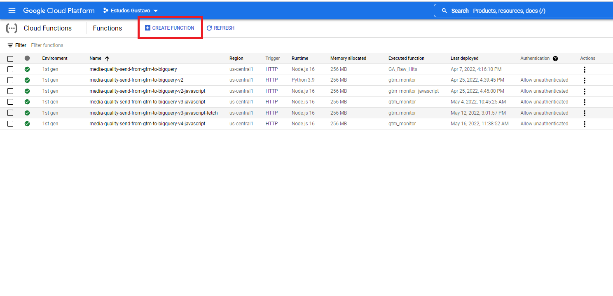
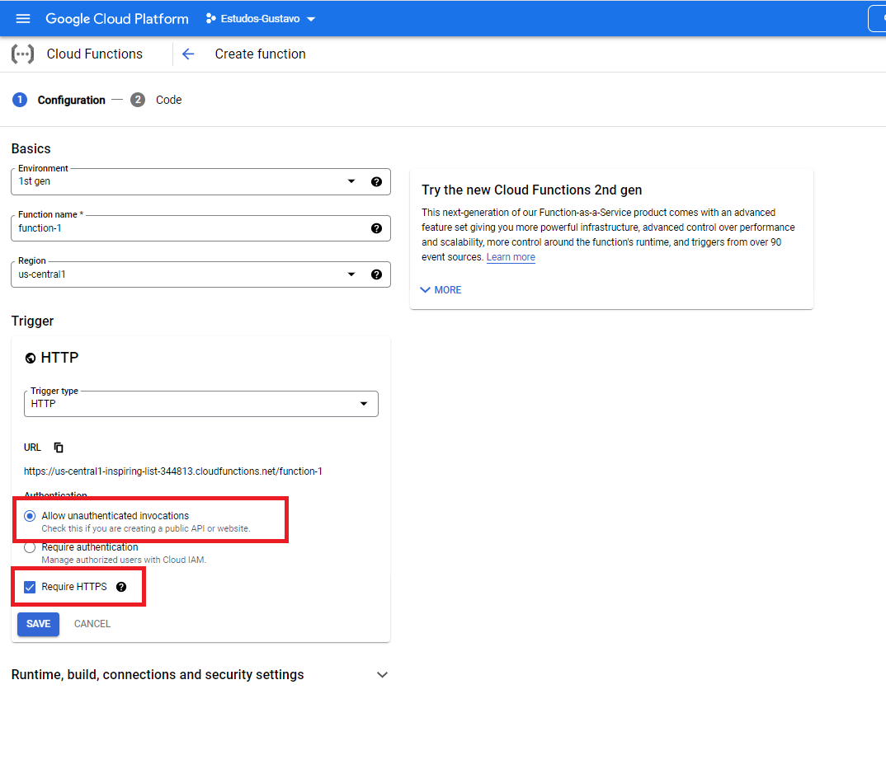
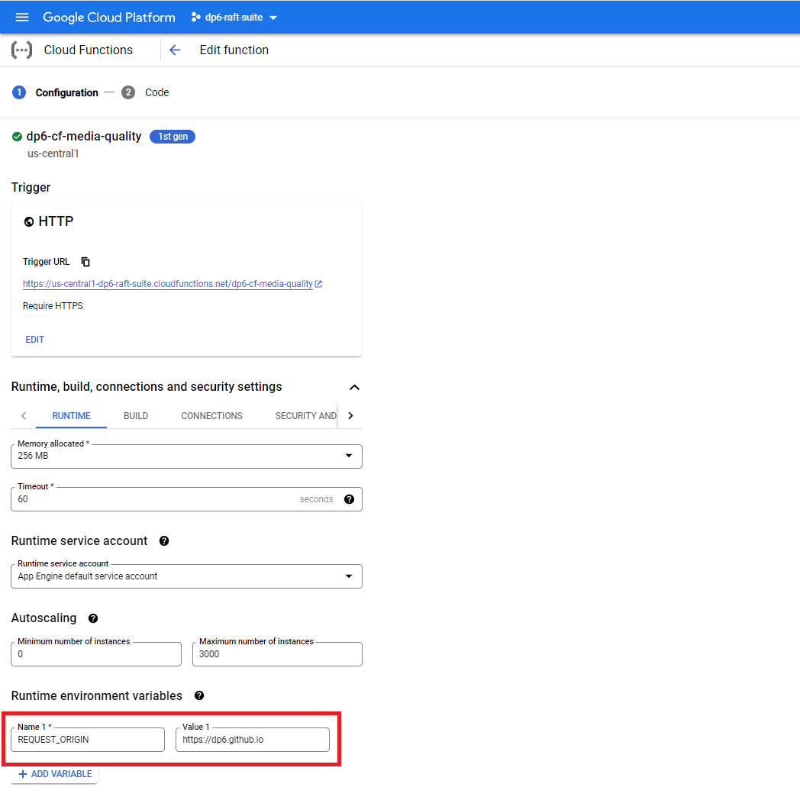
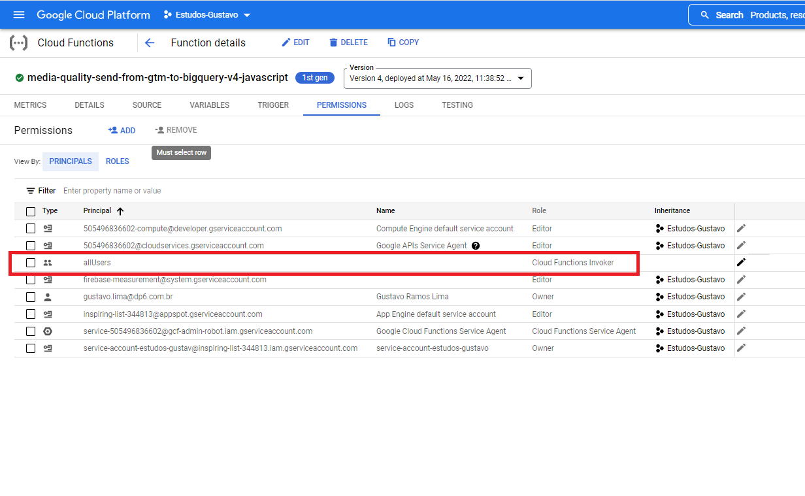
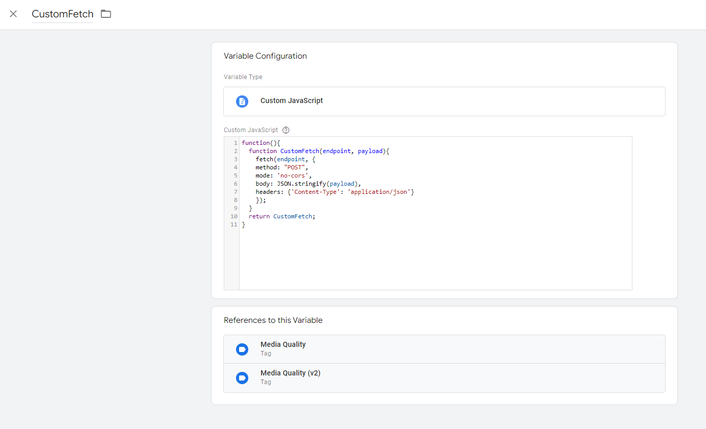
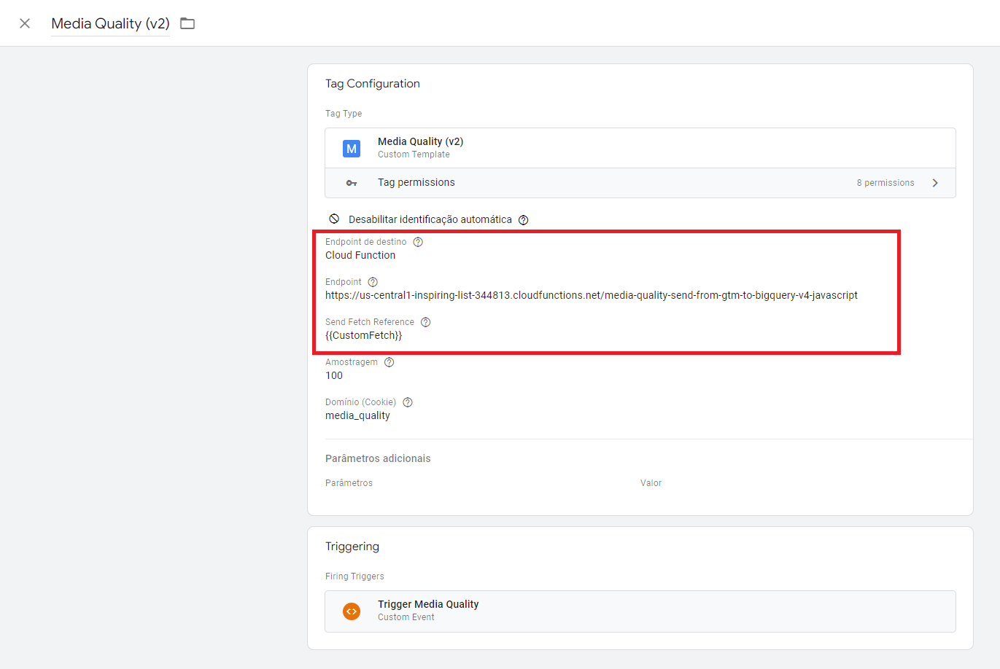

# Configuração com o uso da Cloud Function

Para enviar os dados dos eventos para o Big Query utilizando Cloud Functions é necessário realizar os passos a seguir:

- Criação de dataset e tabela no Big Query;
- Criação de Cloud Function;
- Adequação do custom template para envio de requisições para a Cloud Function.

## Criação de dataset e tabela no Big Query

Para criar a tabela acesse o GCP (Google Cloud Plataform) e crie um dataset com o nome `dp6_media_quality` e uma tabela com o nome `media-quality-raw`.

As colunas criadas na tabela são:

| Nome da Coluna  | Descrição                                     |
| --------------- | --------------------------------------------- |
| media_name      | Nome da mídia que foi disparada               |
| tracking_id     | Id de acompanhamento da mídia disparada       |
| media_event     | Nome do evento disparado                      |
| tag_name        | Nome completo da tag disparada no GTM         |
| status          | Status de disparo da tag                      |
| datalayer_event | Nome do evento do DataLayer que acionou a tag |
| timestamp       | Data e hora do registro                       |

Ao criar a tabela selecione a opção para realizar o particionamento diário dos dados utilizando a coluna `timestamp`. O código abaixo contém um JSON com o esquema da tabela criada.

```javascript
// Esquema da tabela criada no Big Query
[
  {
    name: 'media_name',
    type: 'STRING',
    mode: 'NULLABLE',
    description: 'Nome da midia que foi disparada',
    maxLength: '100',
  },
  {
    name: 'tracking_id',
    type: 'INTEGER',
    mode: 'NULLABLE',
    description: 'Id de acompanhamento da midia disparada',
  },
  {
    name: 'media_event',
    type: 'STRING',
    mode: 'NULLABLE',
    description: 'Nome do evento disparado',
    maxLength: '100',
  },
  {
    name: 'tag_name',
    type: 'STRING',
    mode: 'NULLABLE',
    description: 'Nome completo da tag disparada no GTM',
    maxLength: '100',
  },
  {
    name: 'status',
    type: 'STRING',
    mode: 'NULLABLE',
    description: 'Status de disparo da tag',
    maxLength: '50',
  },
  {
    name: 'datalayer_event',
    type: 'STRING',
    mode: 'NULLABLE',
    description: 'Nome do evento do DataLayer que acionou a tag',
    maxLength: '100',
  },
  {
    name: 'timestamp',
    type: 'TIMESTAMP',
    mode: 'REQUIRED',
    description: 'Data e hora do registro',
  },
];
```

<br>

## Criação de Cloud Function

Para criar a Cloud Function acesse o [GCP](https://console.cloud.google.com/functions) (Google Cloud Plataform) e utilize código diponibilizado abaixo (index.js e package.json). Foram utilizados `Runtime: Node.js 16` e `Entry point: gtm_monitor`. É importante verificar se a Cloud Function está acessível, portanto, verifique a secção `Permissions` para habilitar as permissões necessárias. Para a criação da function foram usados os arquivos `index.js` e `package.json`.

A function recebe uma requisição HTTP que pode conter dados em JSON ou uma URL com query params. Para selecionar uma das opções é preciso alterar o valor da constante `input_option` localizada nas primeiras linhas de código (no arquivo index.js).

Os dados em formato JSON recebidos pela function estão no seguinte formato:

```javascript
{
    "media_name": "media_name",
    "tracking_id": 123,
    "media_event": "media_event",
    "tag_name": "tag_name",
    "status": "status",
    "datalayer_event": "datalayer_event",
    "timestamp": 1652359111.576
}
```

Caso os dados recebidos pelo Cloud Function seja uma URL ela será do seguinte formato:

```
https://{{URL da Cloud Function}}/?media_name={{media_name}}&tracking_id={{tracking_id}}&media_event={{media_event}} ...
```

As informações provenientes da URL são organizadas em um dicionário após a extração por meio de expressões regulares. Posteriormente os dados são enviados para o Big Query.

**index.js**

```javascript
// Import the Google Cloud client library
const { BigQuery } = require('@google-cloud/bigquery');
const bigquery = new BigQuery();
// Request origin allowed in cloud function
var request_origin = process.env.REQUEST_ORIGIN;
request_origin = request_origin.split(",")

// Select what kind of data req.body contains. If the data
// comes from sendPixel method (used on GTM custom template) use "url" else use "json"
const input_option = 'json'; // url ou json

async function insertRowsAsStream(request, input_option) {
  const datasetId = 'mediaQualityDataset';
  const tableId = 'raw_data';
  var json_data;

  if (input_option == 'url') {
    const url = decodeURI(request.protocol + '://' + request.get('host') + request.originalUrl);

    json_data = {
      media_name: url.match('media_name=([^&]+)')[1],
      tracking_id: url.match('tracking_id=([^&]+)')[1],
      media_event: url.match('media_event=([^&]+)')[1],
      tag_name: url.match('tag_name=([^&]+)')[1],
      status: url.match('status=([^&]+)')[1],
      datalayer_event: url.match('datalayer_event=([^&]+)')[1],
      timestamp: Date.now() / 1000,
    };
  }


    const datasetId = 'dp6_media_quality';
    const tableId = 'media-quality-raw';
    var json_data;

    if (input_option == "url"){
      const url = decodeURI(request.protocol + '://' + request.get('host') + request.originalUrl);

      json_data = {
        media_name: url.match("media_name=([^&]+)")[1],
        tracking_id: url.match("tracking_id=([^&]+)")[1],
        media_event: url.match("media_event=([^&]+)")[1],
        tag_name: url.match("tag_name=([^&]+)")[1],
        status: url.match("status=([^&]+)")[1],
        datalayer_event: url.match("datalayer_event=([^&]+)")[1],
        timestamp: Date.now() / 1000
      };

  if (input_option == 'json') {
    try {
      // Parse a JSON
      json_data = JSON.parse(request.body);
    } catch (e) {
      json_data = request.body;

    }

    json_data['timestamp'] = Date.now() / 1000;
  }

  console.log('Enviando payload: ', json_data);
  // Insert data into a table
  await bigquery.dataset(datasetId).table(tableId).insert(json_data);
  console.log(`Inserted rows`);
}

exports.gtm_monitor = (req, res) => {
  if (req.body && req.headers.authorization == secret) {
    insertRowsAsStream(req, input_option);
    console.log('Requisição recebida com sucesso...');
    res.sendStatus(200);
  } else {
    console.log('Requisição inválida. Verifique o payload ou o secret...');
    res.sendStatus(403);
  }


exports.gtm_monitor = (req, res) =>{
    //console.log("BODY="+ req.body);
    console.log("Origem da requisição = " + req.headers.origin);
    //console.log("HEADER=" + JSON.stringify(req.headers));

    if(req.body && request_origin.includes(req.headers.origin)){
      insertRowsAsStream(req, input_option);
      console.log("Requisição recebida com sucesso de: "+ req.headers.host);
      res.sendStatus(200);
    } else
    {
      console.log("Requisição inválida. Verifique o payload ou o secret...");
      res.sendStatus(403);
    }

};
```

**package.json**

```javascript
{
    "name": "dp6-cf-media-quality",
    "version": "1.0.0",
    "description": "envia dados para o bigquery atraves de cloud function",
    "author": "dp6",
    "dependencies": {
      "@google-cloud/bigquery": "^2.1.0"
    },
    "license": "ISC"
  }
```

<br>

## Adequação do custom template para envio de requisições para a Cloud Function

Existem duas maneiras de enviar os dados para a Cloud Function, uma utilizando o método `sendPixel` e a outra utizando `Fetch`.

### Opção 1: sendPixel

O sendPixel é utilizado para realizar requisições do tipo GET. Ela recebe como parâmetro uma URL que é composta por `URL = endpoint + query params`. O endpoint é a URL da Cloud Function enquanto que os query params contém os dados de mídia que serão enviados para a Cloud Function.

### Opção 2: Fetch

O `fetch` permite realizar requisições do tipo POST e o envio de dados no formato JSON. No GTM deve-se criar uma variável do tipo custom javascript e inserir a função responsável pela requisição. Na tag do GTM o campo `sendFetchReference` deve ser preenchido com a variável criada.

**Código javascript utilizado no template de Media Quality (GTM)**

```javascript
...

const encodeUri = require('encodeUri');
const sendPixel = require('sendPixel');
const sendRequestFetch = data.sendFetchReference;

...
function fetchToCF(method) {
  // URL da cloud function
  const endpoint = data.cfEndpoint;

  addEventCallback(function(containerId, eventData) {

    const tagData = eventData.tags.filter(t => t.exclude === 'false');

    for (let i in tagData) {

      let entry = tagData[i];

      let midia_params = {
            media_name: entry.name.split(' - ')[0].split(' (')[0],
            tracking_id: entry.tracking_id,
            media_event: entry.name.split(' - ')[1],
            tag_name: entry.name,
            status: entry.status,
            datalayer_event: event
        };


      if(method =='sendpixel'){
        // Montagem da URL da requisição
        var url = "";

        for (let item in midia_params) {
        url += '&' + item + '=' + midia_params[item];
        }

        url = endpoint+ "/?" + encodeUri(url);
        // Envia requisição utilizando sendPixel
        sendPixel(url,null,null);

      }

      if(method == 'fetch'){
        // Envia requisição utilizando fetch
        sendRequestFetch(endpoint, midia_params);

      }
    }
  });
}

...
```

**Função Fetch (utilizada na custom javascript variable do GTM)**

```javascript
function(){
  function CustomFetch(endpoint, payload){
    fetch(endpoint, {
    method: "POST",
    mode: 'no-cors',
    body: JSON.stringify(payload),
    headers: {'Content-Type': 'application/json'}
    });
  }
  return CustomFetch;
}
```

<br>

## Imagens da Implementação da Cloud Function

Para criar a Cloud function acesse o console do Google Cloud e clique em `Create Function` (Figura 1).


<figcaption>Figura 1 - Preenchimento do campo Endpoint com URL da Cloud Function</figcaption>
</div>

Na etapa de configuração selecione `Allow unauthenticated invocations` e marque `Require HTTPS`


<figcaption>Figura 2 - Preenchimento do campo Endpoint com URL da Cloud Function</figcaption>
</div>

Crie uma variável de ambiente com o nome `REQUEST_ORIGIN` e adicione as URLs das página web separadas por vígula (ex.: https://dp6.com.br,https://dp6.github.io). A Cloud Function apenas será disparada se a requisição for proveniente dos sites listados na variável `REQUEST_ORIGIN`.


<figcaption>Figura 3 - Preenchimento do campo Endpoint com URL da Cloud Function</figcaption>
</div>

Na aba de permissões, `allUsers` deve possuir o papel `Cloud Functions Invoker`


<figcaption>Figura 4 - Preenchimento do campo Endpoint com URL da Cloud Function</figcaption>
</div>

<br>

## Imagens da Implementação no GTM

### Passo 1: Criação da variável javascript

Criação de variável javascript com o código responsável pelas requisições HTTP. Caso seja utilizada a outra forma de envio de dados (sendPixel) não é necessário criar essa variável.

<div align="center">

<figcaption>Figura 5 - Criação de custom javascript com a função fetch.</figcaption>
</div>

### Passo 2: Configuração da TAG no GTM

Após habilitar na tag o "Endpoint de destino" como Cloud Function deve-se inserir a URL de trigger da Cloud Function, a variável javascript criada anteriormente e um segredo (é o secret da cloud function) a ser adicionado na requisição HTTP, conforme o exemplo abaixo (Figura 2).

<div align="center">

<figcaption>Figura 6 - Preenchimento do campo Endpoint com URL da Cloud Function</figcaption>
</div>
