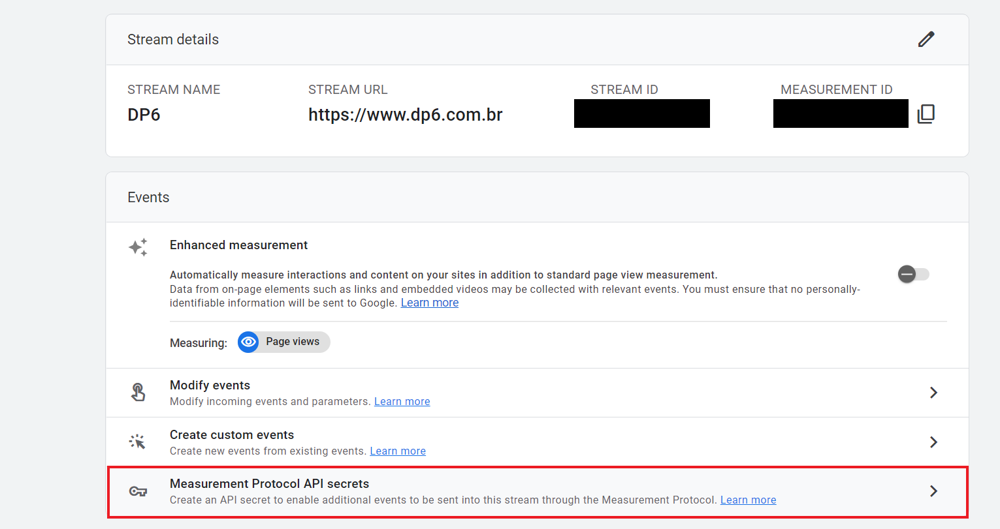
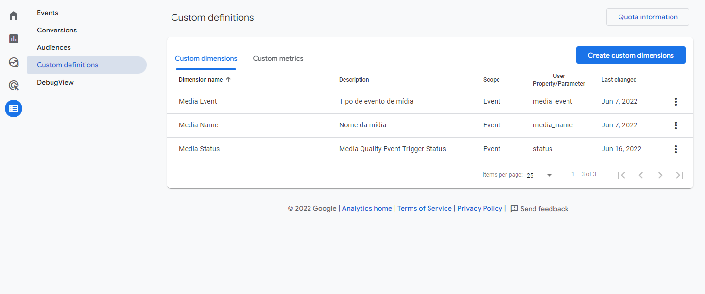

# Configuração com o uso do GA4

No Google Analytics 4 deve ser criada uma conta e um fluxo de dados. O valor do _MEASUREMENT ID_ deve ser utilizado no GTM para o envio das informações.

## Configuração do Measurement Protocol

O Measurement Protocol permite que os dados sejam enviados para o GA4 diretamente a partir de requisições HTTP. Para utilizá-lo é necessário criar um **secret** que é enviado nas requisições, adicionando uma camada de segurança. Para criar o API secret no GA4 vá para `Admin > Data Streams > Escolha seu stream > Measurement Protocol`.

<figcaption>Figura 1 - Configuração de secret do Measurement Protocol para um fluxo de dados.</figcaption>

## Declaração de custom dimensions

Para que algumas informações dos eventos de mídia sejam utilizadas no relatórios do GA4 é necessário registrá-las como dimensões personalizadas. Para criar uma dimensão personalizada vá em `Configure > Custom Definitions > Create custom dimensions`. Foram criadas dimensões para os parâmetros `media_event`, `media_name` e `status`.

<figcaption>Figura 2 - Criação de dimensões personalizadas no GA4</figcaption>

