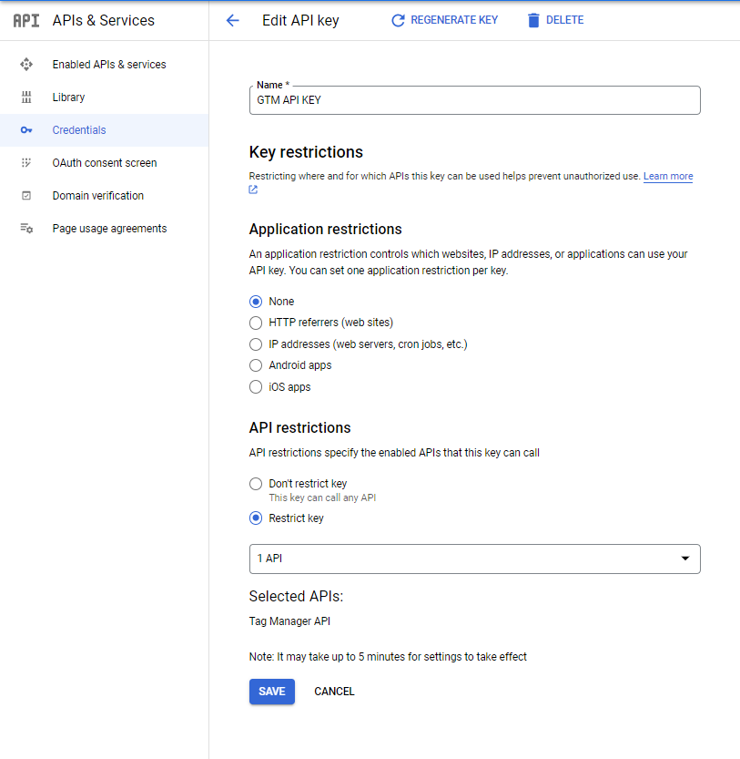
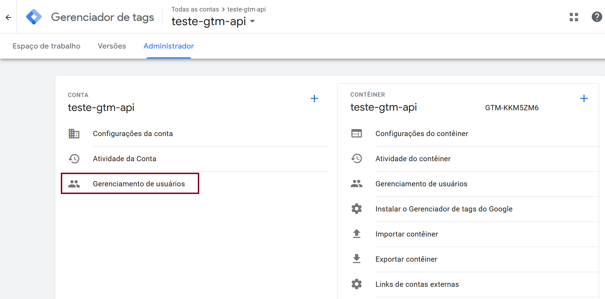
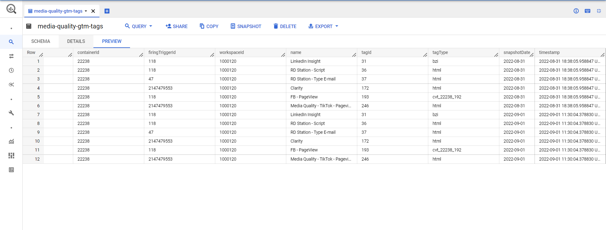

# Media Tag Collect from Google Tag Manager API

Daily a Cloud function can be used to retrieve the list of avaiable media tags from GTM, being possible to identify which tags are avaiable and which ones that are no being triggered. All data is stored in a BigQuery table and may enrich media quality's analysis.

This tutorial aims to serve as guide to get data about tags, triggers,.. from Google Tag Manager API. The idea is to use HTTP requests to
access the data instead of using Python libraries.

> :warning: **The data will be stored in a BigQuery table. This feature is optional and can improve report analysis.**

There are several steps that need to be followed:

## Step 1 - Create Credentials

- 1.1 Create a GCP project;

- 1.2 Activate **Tag Manager API** in `APIs & Services > Enabled APIs & services`;

- 1.3 Go to `APIs & Services > Credentials > + Create Credentials > Service Account` and create se service account. Don't forget to save the credentials in a JSON file (optional);

- 1.4 Create an API key in `APIs & Services > Credentials > + Create Credentials > API key`. It's important to restrict the key to only "Tag Manager API" (Figure 1).


<figcaption>Figure 1 - API Key Configuration</figcaption>

## Step 2 - Cloud Function settings

Using the avaiable code create a Cloud Funtion (using Python 3.10). The Google Cloud Schedule can be used to schedule a daily execution of the cloud function.

## Step 3 - GTM Settings

To connect GTM with the services from GCP it's important to add the service account associated with the Cloud Function as a GTM user.


<figcaption>Figure 2 - Add service account as GTM user</figcaption>

## Step 4 - BigQuery Settings

The data obtained from GTM is stored in BigQuery. For example, was created the dataset `media_quality` and the table `media-quality-gtm-tags`.

Table created in BigQuery:

| Column Name     | Description                     |
| --------------- | ------------------------------- |
| accountId       | Google Tag Manager account ID   |
| containerId     | Google Tag Manager container ID |
| firingTriggerId | Trigger ID                      |
| workspaceId     | Google Tag Manager workspace ID |
| name            | Tag name                        |
| tagId           | Tag ID                          |
| tagType         | Tag type                        |
| snapshotDate    | Date of snapshot                |
| timestamp       | Date and time of data insertion |

To create the table in BigQuery use the Python function as above:

```python
def bq_create_media_tags_table(project_name, dataset_name, table_name, client) -> None:
	r"""Create dataset dataset and table in Big Query

	Args:
		project_name (string): name of GCP project
		dataset_name (string): name o Big Query dataset
		table_name (string): name of table
		client: Big Query Client instance

	"""
	client.query(f"CREATE SCHEMA IF NOT EXISTS {dataset_name}")

	client.query(f"CREATE TABLE IF NOT EXISTS {project_name}.{dataset_name}.{table_name}  ( \
				accountId STRING,\
				containerId STRING, \
				firingTriggerId STRING, \
				workspaceId STRING, \
				name STRING, \
				tagId STRING, \
				tagType STRING, \
				snapshotDate DATE, \
				timestamp TIMESTAMP	)")
```

## Reference code used in cloud function

The code is used in Cloud Function to list GTM tags and filter only "Media Tags"

```python

from google.oauth2 import service_account
from google.cloud import bigquery
import google.auth.transport.requests
import requests
import json
import datetime
from google.auth import default

# ------------------------------------
RUN_AS_CLOUD_FUNCTION = False # Change if deploy as cloud function
# ------------------------------------

"""
HOW TO RUN LOCALLY
$ pip install functions-framework
$ functions-framework --target my_function
Which will start a local development server at http://localhost:8080.

To invoke it locally for an HTTP function:

$ curl http://localhost:8080
For a background function with non-binary data:

$ curl -d '{"data": {"hi": "there"}}' -X POST \
-H "Content-Type: application/json" \
http://localhost:8080
"""


# Authentication settings
SCOPES = ['https://www.googleapis.com/auth/tagmanager.readonly', "https://www.googleapis.com/auth/cloud-platform"]
SERVICE_ACCOUNT_FILE = './credentials/teste-gtm-api-3629bf94ffcb.json' # optional
API_KEY = "<API KEY code>" # Change values

# GTM info
GTM_ACCOUNT = "6054543647" # Change values
GTM_CONTAINER = "92108926" # Change values
GTM_WORKSPACE = "2" # Change values

# GCP info
PROJECT_NAME = "teste-gtm-api" # Change values
DATASET_NAME = "media_quality" # Change values
TABLE_NAME = "media-quality-gtm-tags" # Change values


def bq_create_media_tags_table(project_name, dataset_name, table_name, client) -> None:
	r"""Create dataset dataset and table in Big Query

	Args:
		project_name (string): name of GCP project
		dataset_name (string): name o Big Query dataset
		table_name (string): name of table
		client: Big Query Client instance

	"""
	client.query(f"CREATE SCHEMA IF NOT EXISTS {dataset_name}")

	client.query(f"CREATE TABLE IF NOT EXISTS {project_name}.{dataset_name}.{table_name}  ( \
				accountId STRING,\
				containerId STRING, \
				firingTriggerId STRING, \
				workspaceId STRING, \
				name STRING, \
				tagId STRING, \
				tagType STRING, \
				snapshotDate DATE, \
				timestamp TIMESTAMP	)")


def bq_insert_to_table(data, table_id, client) -> None:
	r"""Insert data to Big Query table

	Args:
		data (list of JSON): data to be inserted into table
		table_id (string): table id from Big Query in format <projectId>.<datasetId>.<tableName>
	"""

	table_obj = client.get_table(table_id)
	errors = client.insert_rows(table=table_obj, rows=data)
	if errors == []:
		print("New rows have been added.")
	else:
		print("Encountered errors while inserting rows: {}".format(errors))


def _get_credentials():
	r""" Get credentials from GCP.
	If constant RUN_AS_CLOUD_FUNCTION is true the credential will be acquired from GCP credential's default.

	If constant RUN_AS_CLOUD_FUNCTION is false the credential will be acquired from JSON file.

	"""
	credentials = None
	# Creates a Credentials instance from a service account json file
	if RUN_AS_CLOUD_FUNCTION:
		credentials, _ = default(scopes=SCOPES)
	else:
		credentials = service_account.Credentials.from_service_account_file(SERVICE_ACCOUNT_FILE, scopes=SCOPES)
	# Created authenticated session
	auth_req = google.auth.transport.requests.Request()
	# Refreshes token
	credentials.refresh(auth_req)
	# Return token
	return credentials


def list_tags(gtm_account, gtm_container, gtm_workspace, api_key, token):
	r""" List all GTM tags

	Args:
		gtm_account (string): Google Tag Manager account number
		gtm_container (string): Google Tag Manager container number
		gtm_workspace (string): Google Tag Manager workspace number
		api_key (string): API key create in GCP to interact with GTM API
		token (string): Token required for request

	Outputs:
		response_json (json): dictionary of tags from GTM

	"""
	endpoint = f"https://tagmanager.googleapis.com/tagmanager/v2/accounts/{gtm_account}/containers/{gtm_container}/workspaces/{gtm_workspace}/tags?key={api_key}"
	headers = {"Accept": "application/json", "Authorization": f"Bearer {token}"}
	try:
		# Make a HTTP GET request
		response = requests.get(url=endpoint, headers=headers)
		response_json = response.json()
		return response_json
	except:
		raise Exception


def _parse_media_tags(list_of_tags):
	r"""Filter media tags and parse data

	Args:
		list_of_tags (json): dictionary with all tags

	Output:
		json with parsed data for media tags
	"""

	media_json_list = []
	current_date = datetime.datetime.now()
	current_date_formatted = current_date.strftime("%Y-%m-%d")
	for tag in list_of_tags["tag"]:
		add_to_list = False

		json_sanity_check = ("monitoringMetadata" in tag) and ("map" in tag["monitoringMetadata"])

		if json_sanity_check == True:
			for param in tag["monitoringMetadata"]["map"]:
				if param["key"] == "exclude" and param["value"] == "false":
					add_to_list = True
		if add_to_list:
			reduced_json = { "accountId": tag["accountId"],
							"containerId": tag["containerId"],
							"firingTriggerId": tag["firingTriggerId"][0],
							"workspaceId": tag["workspaceId"],
							"name": tag["name"],
							"tagId": tag["tagId"],
							"tagType": tag["type"],
							"snapshotDate": current_date_formatted,
							"timestamp": current_date }
			media_json_list.append(reduced_json)
	return media_json_list


def main():

	# Get credentials and token
	credentials = _get_credentials()
	token = credentials.token
	# Create Big Query client
	bq_client = bigquery.Client(credentials=credentials)
	# Create schema and BigQuery table
	# bq_create_media_tags_table(project_name=PROJECT_NAME, dataset_name=DATASET_NAME, table_name=TABLE_NAME, client=bq_client)
	# Get list of tags from Google Tag Manager (GTM)
	list_of_tags = list_tags(gtm_account=GTM_ACCOUNT, gtm_container=GTM_CONTAINER, gtm_workspace=GTM_WORKSPACE, api_key=API_KEY, token=token)
	# Filter media tags and parse data
	media_json_list = _parse_media_tags(list_of_tags)
	# Save list of JSONs to Big Query table
	bq_insert_to_table(data=media_json_list, table_id=f"{PROJECT_NAME}.{DATASET_NAME}.{TABLE_NAME}", client=bq_client)

	if RUN_AS_CLOUD_FUNCTION:
		return "Success", 200


```

Code **requirements.txt** file:

```
Authlib==1.0.1
gcloud==0.18.3
google-api-core==2.8.2
google-auth==2.9.1
google-cloud-bigquery==3.3.2
google-cloud-bigquery-storage==2.14.2
google-cloud-core==2.3.2
google-cloud-storage==2.4.0
google-crc32c==1.3.0
google-resumable-media==2.3.3
googleapis-common-protos==1.56.4
ipython==8.4.0
matplotlib==3.5.2
numpy==1.23.1
requests==2.28.1
PyYAML==6.0

```

## GTM API Output Example

The output JSON from when using GTM's API in `list` action follow the pattern bellow:

```json
{
  "tag": [
    {
      "accountId": "6054543647",
      "consentSettings": {
        "consentStatus": "notSet"
      },
      "containerId": "92108926",
      "fingerprint": "1661519637804",
      "firingTriggerId": ["2147479553"],
      "monitoringMetadata": {
        "map": [
          {
            "key": "exclude",
            "type": "template",
            "value": "false"
          },
          {
            "key": "tracking_id",
            "type": "template",
            "value": "1123"
          },
          {
            "key": "media_name",
            "type": "template",
            "value": "Hello"
          }
        ],
        "type": "map"
      },
      "monitoringMetadataTagNameKey": "name",
      "name": "Say Hello",
      "parameter": [
        {
          "key": "html",
          "type": "template",
          "value": "<script>\nconsole.log(\"HELLO!!!\");\n</script>"
        },
        {
          "key": "supportDocumentWrite",
          "type": "boolean",
          "value": "false"
        }
      ],
      "path": "accounts/6054543647/containers/92108926/workspaces/2/tags/3",
      "tagFiringOption": "oncePerEvent",
      "tagId": "3",
      "tagManagerUrl": "https://tagmanager.google.com/#/container/accounts/6054543647/containers/92108926/workspaces/2/tags/3?apiLink=tag",
      "type": "html",
      "workspaceId": "2"
    },
    {
      "accountId": "6054543647",
      "consentSettings": {
        "consentStatus": "notSet"
      },
      "containerId": "92108926",
      "fingerprint": "1661516539340",
      "firingTriggerId": ["2147479553"],
      "monitoringMetadata": {
        "type": "map"
      },
      "name": "Tag agora VAI",
      "parameter": [
        {
          "key": "html",
          "type": "template",
          "value": "<script>console.log(\"AGORA VAI DISPARADA!\");</script>"
        },
        {
          "key": "supportDocumentWrite",
          "type": "boolean",
          "value": "false"
        }
      ],
      "path": "accounts/6054543647/containers/92108926/workspaces/2/tags/4",
      "tagFiringOption": "oncePerEvent",
      "tagId": "4",
      "tagManagerUrl": "https://tagmanager.google.com/#/container/accounts/6054543647/containers/92108926/workspaces/2/tags/4?apiLink=tag",
      "type": "html",
      "workspaceId": "2"
    },
    {
      "accountId": "6054543647",
      "consentSettings": {
        "consentStatus": "notSet"
      },
      "containerId": "92108926",
      "fingerprint": "1661517732659",
      "firingTriggerId": ["6"],
      "monitoringMetadata": {
        "type": "map"
      },
      "name": "DQ - MEDIA QUALITY - CF",
      "parameter": [
        {
          "key": "fetchReference",
          "type": "template",
          "value": "codigo do fetch"
        },
        {
          "key": "clientId",
          "type": "template",
          "value": "11234567"
        },
        {
          "key": "cfEndpoint",
          "type": "template",
          "value": "https://www.meuendpointwwwwwwwwwwwwwwwwwwwwwwwwwww.cloudfunctions.com"
        },
        {
          "key": "method",
          "type": "template",
          "value": "post"
        },
        {
          "key": "typeEndpoint",
          "type": "template",
          "value": "cf"
        },
        {
          "key": "autoCollect",
          "type": "boolean",
          "value": "true"
        },
        {
          "key": "domain",
          "type": "template",
          "value": "www.dp6.com.br"
        },
        {
          "key": "sample",
          "type": "template",
          "value": "100"
        }
      ],
      "path": "accounts/6054543647/containers/92108926/workspaces/2/tags/7",
      "tagFiringOption": "oncePerEvent",
      "tagId": "7",
      "tagManagerUrl": "https://tagmanager.google.com/#/container/accounts/6054543647/containers/92108926/workspaces/2/tags/7?apiLink=tag",
      "type": "cvt_92108926_5",
      "workspaceId": "2"
    }
  ]
}
```

## Expect Result


<figcaption>Figure 3 - Table with current media tags in GTM</figcaption>
