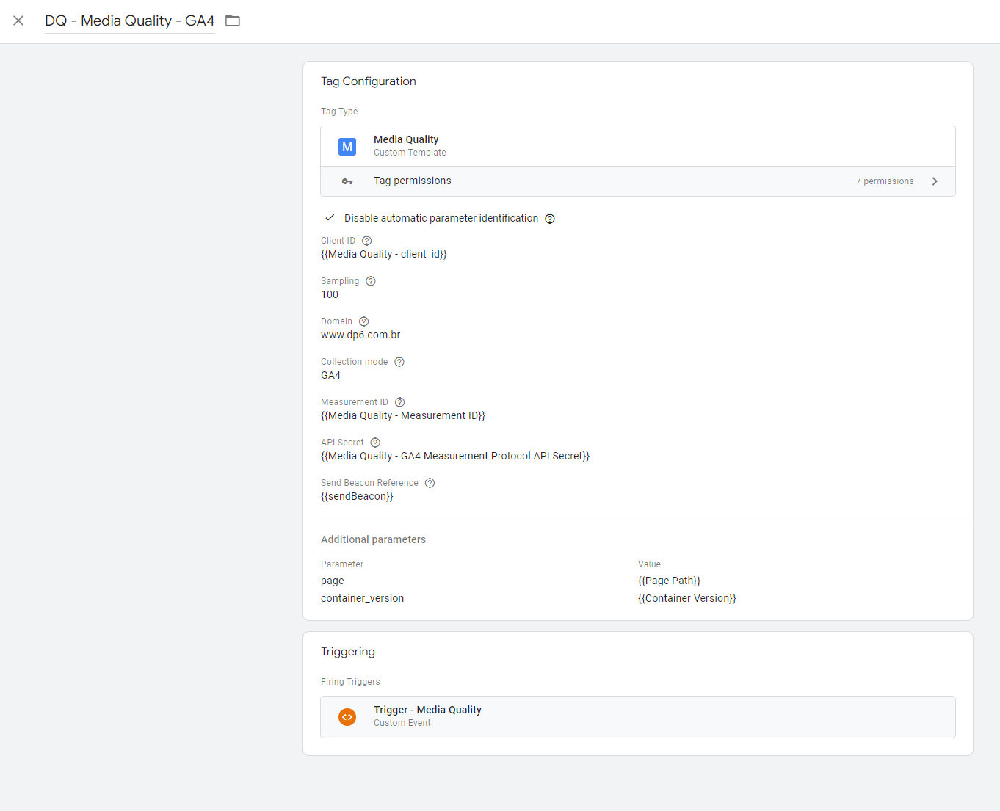

# Configuração do Google Tag Manager (GTM)

Após criar uma conta no GTM é necessário adicionar o template da tag de Media Quality. É possível criar uma tag de configuração para o GA4 e outra para que os dados sejam enviados para a cloud function.

## Importação do tag template de media quality

Para adicionar o template da tag de media quality baixe o arquivo **.tpl** disponível em `/gtm/tag_template.tpl`.

No GTM, na secção `Workspace` clique em `Templates`. Em `Tag Templates` clique em `New`. No canto superior direito clique no ícone com "três pontos" e clique em `Import`.

## Criação de tags

Para adicionar a tag, clique em `Tags > New`, selecione o tag template de Media Quality criado anteriormente. A tag possui os campos a seguir:

- **Client ID:** ID único de identificação de usuário (ex.: 1112001.123219435344);
- **Sampling:** Define o percentual de clientes que serão monitorados (ex.: 10, 50, 100);
- **Domain:** Domínio a ser monitorado (ex.: www.dp6.com.br);
- **Collection mode:** Determina para onde os dados serão enviados ("GA4" ou "Cloud Function");
- **Measurement ID:** Measurement ID do GA4, ex.: G-6YTF07BEBK (disponível apenas se Collection mode é "GA4");
- **API Secret:** A solução utiliza o Measurement Protocol do GA4. Para criar o API secret vá para `Admin > Data Streams > Escolha seu stream > Measurement Protocol` (disponível apenas se Collection mode é "GA4");
- **Send Beacon Reference:** Adiciona referência ao custom javascript sendBeacon (disponível apenas se Collection mode é "GA4"). Deve ser criada uma variável do tipo javascript com o código a seguir:

```js
function () {
  function sendBeacon(endpoint, body) {
    navigator.sendBeacon(endpoint, body);
  }
  return sendBeacon;
}
```

- **Endpoint:** É a URL da cloud function para onde os dados devem ser enviados, ex.: "https://us-central1-dp6-raft-suite.cloudfunctions.net/dp6-cf-media-quality" (disponível apenas se Collection mode é "Cloud Function "). Para identificar qual URL utilizar acesse o console do Google Cloud, e verifique os detalhes da cloud function que foi criada. Lá é possível obter qual URL utilizar nas requisições;
- **Request Method:** O método "GET" faz com que seja utilizada internamente a função "sendPixel". Para o método "POST" é preciso criar uma função javascript que deve ser referenciada no parâmetro abaixo "Fetch Reference". Recomenda-se utilizar o método "POST" (disponível apenas se Collection mode é "Cloud Function");
- **Fetch Reference:** Adiciona referência ao custom javascript que realiza requisições HTTP (disponível apenas se Collection mode é "Cloud Function" e Request Method é "POST"). Deve ser criada uma variável do tipo javascript com o código a seguir:

```js
function(){
  function CustomFetch(endpoint, payload){
    fetch(endpoint, {
    method: "POST",
    mode: 'no-cors',
    body: JSON.stringify(payload),
    headers: {'Content-Type': 'application/json'}
    });
  }
  return CustomFetch;
}
```

Parâmetros adicionais (utilizar apenas se o parâmetro `Collection mode` for GA4):

- **page:** Caminho da página ex.: /pages/contact-us/
- **container_version:** Versão do container do GTM

_Importante:_ Caso os nomes das tags de mídia sigam o padrão `<Nome da mídia> - <Nome do evento>` os valores dos parâmetros `media_name` e `media_event` podem ser obtidos automaticamente se o checkbox "Disable automatic parameter identification" estiver **desabilitado**. Caso o checkbox seja **habilitado**, os valores dos parâmetros `media_name` e `media_event` devem ser inseridos manualmente como parämetro adicional nas tags de mídia.

### Tag de configuração do GA4

A imagem a seguir (Figura 1) mostra um exemplo de preenchimento da tag de configuração de Media Quality contendo os campos mencionados anteriormente.

<div align="center">

<figcaption>Figura 1 - Criação de tag de configuração de mídia para o GA4.</figcaption>
</div>

### Tag de configuração da cloud function

A Figura 2 mostra um exemplo de configuração da tag de Media Quality responsável pelo envio de dados para a cloud function.

<div align="center">

<figcaption>Figura 2 - Criação de tag de configuração de mídia que utiliza cloud function.</figcaption>
</div>

### Rastreando tags de mídia

Para que uma tag de mídia (Figura 3) seja rastreada é necessário incluir algumas informações em `Additional Tag Metadata`:

- Selecine "Include tag name" e em "Key for tag name" preencha com o valor `name`;
- **exclude:** `false`;
- **tracking_id:** Código de rastreio da tag de mídia;
- **media_name:** Nome da mídia, ex.: Facebook;
- **media_event:** Evento associado a uma mídia, ex.: pageview.

_Observação 1:_ Os parâmetros `media_name` e `media_event` são opcionais e devem ser utilizados apenas se durante a tag de configuração de Media Quality a opção "Disable automatic parameter identification" foi selecionada.

_Observação 2:_ É importante que o parâmetro `exclude` seja utilizado, e que o seu valor seja `false`. Esse parâmetro serve para identificar quais tags de mídia terão seus dados coletados.

<div align="center">

<figcaption>Figura 3 - Adição de informações para rastreio de tag de mídia.</figcaption>
</div>

## Criação de Gatilho

Um gatilho (Figura 4) é responsável por ativar as tags a partir de determinados critérios. Em Media Quality foi criado um gatilho simples, que dispara as tags sempre que um evento qualquer acontece. Como foi mencionado anteriormente, apenas serão coletados os dados de tags que contenham o parâmetro `exclude` com o valor `false`.

<div align="center">

<figcaption>Figura 4 - Gatilho dos eventos de Media Quality.</figcaption>
</div>
